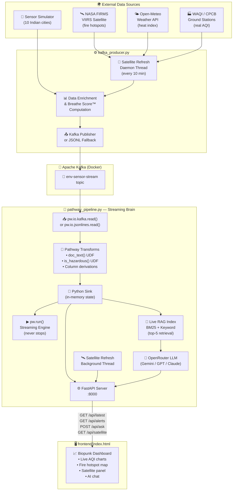
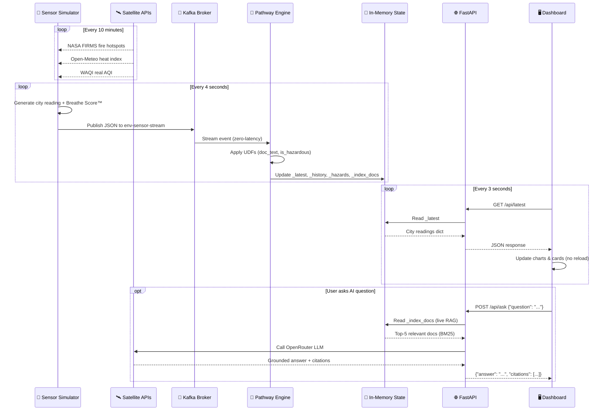
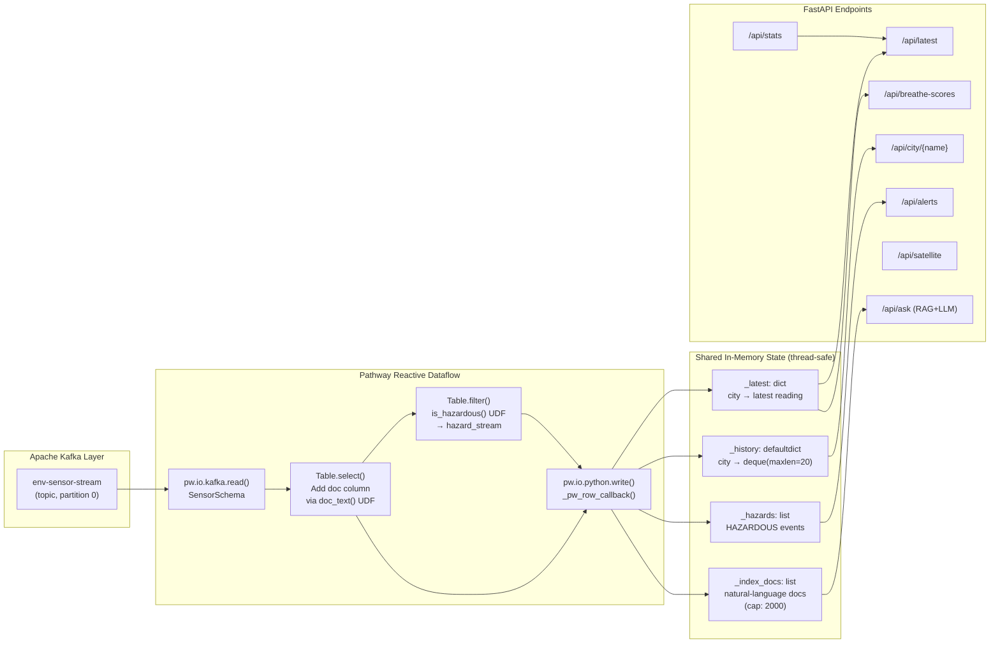
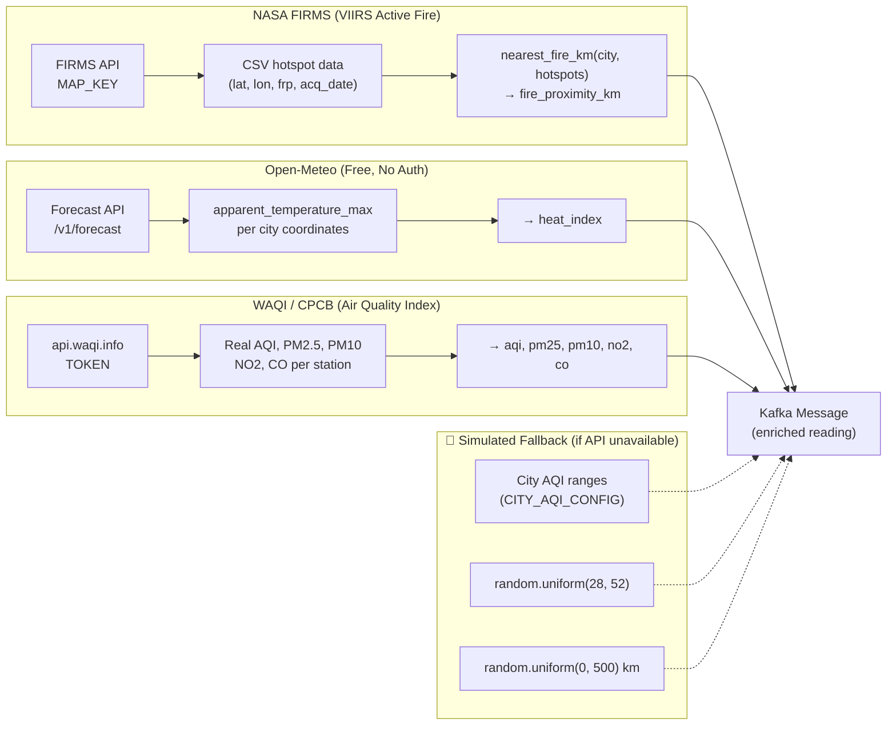
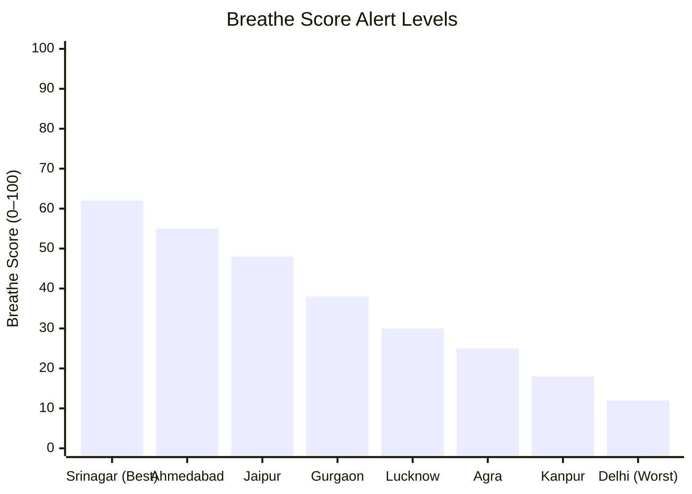
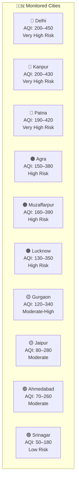
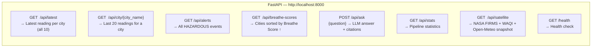

<div align="center">


[](https://python.org)
[](https://pathway.com)
[](https://kafka.apache.org)
[](https://fastapi.tiangolo.com)
[](https://docker.com)
[](LICENSE)
[](CONTRIBUTING.md)

<br/>

> **GreenPulse India** is an open-source, real-time environmental intelligence platform that streams, processes, and visualizes air quality, satellite fire data, river toxicity, and heat index across **10 major Indian cities** — powered by [Pathway](https://pathway.com), Apache Kafka, and NASA satellite APIs.

**[📖 Docs](#-quick-start) · [🚀 Demo](#-ui-screenshots) · [🤝 Contributing](CONTRIBUTING.md) · [🐛 Issues](https://github.com/your-org/GreenPulse-India/issues)**

</div>

---

## 📋 Table of Contents

- [✨ Features](#-features)
- [🏗️ System Architecture](#️-system-architecture)
- [🔄 Data Flow](#-data-flow)
- [📡 Real-Time Pipeline Deep Dive](#-real-time-pipeline-deep-dive)
- [🛰️ Satellite Data Integration](#️-satellite-data-integration)
- [💨 The Breathe Score™](#-the-breathe-score)
- [🗺️ City Coverage](#️-city-coverage)
- [🚀 Quick Start](#-quick-start)
- [⚙️ Configuration](#️-configuration)
- [🌐 API Reference](#-api-reference)
- [🗂️ Project Structure](#️-project-structure)
- [🧪 Testing](#-testing)
- [🖼️ UI Screenshots](#️-ui-screenshots)
- [🤝 Contributing](#-contributing)
- [📜 Changelog](#-changelog)
- [📄 License](#-license)

---

## ✨ Features

| Feature | Description |
|---|---|
| ⚡ **Zero-latency streaming** | Pathway's reactive dataflow processes each Kafka event the instant it arrives |
| 🛰️ **NASA FIRMS integration** | Live VIIRS satellite fire hotspot data over the Indian subcontinent |
| 🌡️ **Open-Meteo weather** | Real apparent temperature (heat index) from free open APIs |
| 🏭 **WAQI/CPCB AQI** | Real-time AQI from CPCB ground stations via the WAQI API |
| 🤖 **Live RAG AI chat** | Ask questions grounded in the live data stream via OpenRouter LLMs |
| 🌿 **Breathe Score™** | Proprietary composite metric combining AQI, fire, heat & river toxicity |
| 🗺️ **10 cities tracked** | Delhi, Kanpur, Patna, Agra, Muzaffarpur, Lucknow, Gurgaon, Jaipur, Ahmedabad, Srinagar |
| 🎨 **Biopunk dashboard** | Self-contained dark-mode HTML dashboard — no framework, no rebuild step |
| 🔄 **Dual-mode streaming** | Kafka for production, JSONL file fallback for local dev |
| 🐳 **Docker-ready** | One `docker-compose up` launches Kafka + Zookeeper + UI |

---

## 🏗️ System Architecture



---

## 🔄 Data Flow



---

## 📡 Real-Time Pipeline Deep Dive



---

## 🛰️ Satellite Data Integration

GreenPulse pulls from **three free real-world APIs** with graceful fallback to simulation:



---

## 💨 The Breathe Score™

The **Breathe Score** (0–100) is GreenPulse's signature composite environmental liveability metric:

```
breathe_score = max(0,
    100
    − (aqi / 5)
    − (river_tox_index × 2)
    − (max(0, 500 − fire_proximity_km) / 50)
    − (max(0, heat_index − 35) × 1.5)
)
```



| Score Range | Alert Level | Visual | Interpretation |
|---|---|---|---|
| > 60 | **SAFE** | 🟢 | Air is safe for all groups |
| 40–60 | **MODERATE** | 🟡 | Sensitive groups limit outdoor activity |
| 20–40 | **POOR** | 🟠 | Avoid prolonged outdoor exposure |
| < 20 | **HAZARDOUS** | 🔴 | Stay indoors; health risk for everyone |

---

## 🗺️ City Coverage



| City | Lat/Lon | Typical AQI | Primary Pollution Source |
|---|---|---|---|
| Delhi | 28.61°N 77.21°E | 200–450 | Industrial emissions + traffic congestion |
| Kanpur | 26.45°N 80.33°E | 200–430 | Leather & textile industry effluents |
| Patna | 25.59°N 85.14°E | 190–420 | Brick kilns + river transport |
| Agra | 27.18°N 78.01°E | 150–380 | Marble dust + tourism vehicle exhaust |
| Muzaffarpur | 26.12°N 85.36°E | 160–390 | Sugarcane burning seasons |
| Lucknow | 26.85°N 80.95°E | 130–350 | Rapid urbanisation + construction dust |
| Gurgaon | 28.46°N 77.03°E | 120–340 | IT hub construction + NCR vehicle load |
| Jaipur | 26.91°N 75.79°E | 80–280 | Desert dust storms + heritage tourism |
| Ahmedabad | 23.02°N 72.57°E | 70–260 | Chemical/petrochemical corridors |
| Srinagar | 34.08°N 74.80°E | 50–180 | Valley geography traps winter smog |

---

## 🚀 Quick Start

### Prerequisites

| Tool | Version | Purpose |
|---|---|---|
| [Docker Desktop](https://www.docker.com/products/docker-desktop/) | ≥ 4.x | Runs Kafka + Zookeeper via Compose |
| [Python](https://www.python.org/downloads/) | ≥ 3.10 | Producer + pipeline runtime |
| pip | latest | `python -m pip install --upgrade pip` |
| OpenRouter API key *(optional)* | — | Enables AI chat via any LLM |
| NASA FIRMS MAP_KEY *(optional)* | — | Real satellite fire data |
| WAQI Token *(optional)* | — | Real CPCB AQI data |

---

### Step 1 — Clone the repository

```bash
git clone https://github.com/your-org/GreenPulse-India.git
cd GreenPulse-India
```

### Step 2 — Configure environment variables

```bash
# Windows (PowerShell)
copy .env.example .env

# macOS / Linux
cp .env.example .env
```

Edit `.env` and fill in your keys (all optional — the platform runs in simulation mode without them):

```env
OPENROUTER_API_KEY=sk-or-...      # Any LLM via openrouter.ai
FIRMS_MAP_KEY=...                 # NASA FIRMS — get free key at firms.modaps.eosdis.nasa.gov
WAQI_TOKEN=...                    # WAQI — get free token at aqicn.org/api/
```

### Step 3 — Start Kafka infrastructure

```bash
docker-compose up -d
```

This launches:
- **Zookeeper** on port `2181`
- **Kafka broker** on port `9092` with `env-sensor-stream` auto-created
- **Kafka UI** at [http://localhost:8080](http://localhost:8080)

Verify containers are healthy (wait ~15 seconds):

```bash
docker-compose ps
```

### Step 4 — Install Python dependencies

```bash
pip install -r requirements.txt
```

> **Note on Pathway:** Requires `pathway >= 0.14.0`. If you get install errors:
> ```bash
> pip install pathway --pre
> ```

### Step 5 — Start the sensor stream producer

Open **Terminal 1**:

```bash
python src/kafka_producer.py
```

Expected output:
```
============================================================
  GreenPulse India — Kafka Producer + Satellite Enrichment
============================================================
[Satellite] ↻ Refreshing: NASA FIRMS · Open-Meteo · WAQI…
[Kafka] ✓ Connected to broker at localhost:9092
[KAFKA] #00001 | Delhi          | AQI=312 | BS=18.4 | HAZARDOUS   | aqi=WAQI_CPCB/weather=Open-Meteo/fire=NASA_FIRMS
[KAFKA] #00002 | Kanpur         | AQI=287 | BS=22.1 | POOR        | aqi=simulated/weather=Open-Meteo/fire=simulated
```

### Step 6 — Start the Pathway pipeline + FastAPI server

Open **Terminal 2**:

```bash
python src/pathway_pipeline.py
```

Expected output:
```
============================================================
  GreenPulse India — Environmental Intelligence Platform
============================================================
[Pathway] ✓ Kafka available — using pw.io.kafka.read()
[Pathway] ▶ Starting streaming engine with pw.run() …
[Main] FastAPI listening on http://0.0.0.0:8000
```

### Step 7 — Open the dashboard

```bash
# Windows
start frontend/index.html

# macOS
open frontend/index.html

# Or serve via HTTP (fixes some CORS edge cases)
cd frontend && python -m http.server 3000
# → Open http://localhost:3000
```

🎉 **Everything is live!** The dashboard auto-polls every 3 seconds and updates without any page reload.

---

## ⚙️ Configuration

All configuration is driven by environment variables in `.env`:

| Variable | Default | Description |
|---|---|---|
| `KAFKA_BOOTSTRAP` | `localhost:9092` | Kafka broker address |
| `FASTAPI_PORT` | `8000` | FastAPI server port |
| `OPENROUTER_API_KEY` | *(empty)* | AI chat via [openrouter.ai](https://openrouter.ai) |
| `OPENROUTER_MODEL` | `google/gemini-flash-1.5` | LLM model for RAG answers |
| `FIRMS_MAP_KEY` | *(empty)* | NASA FIRMS satellite fire data |
| `WAQI_TOKEN` | *(empty)* | WAQI / CPCB real AQI data |

---

## 🌐 API Reference

All endpoints served on `http://localhost:8000`. Interactive docs at [`/docs`](http://localhost:8000/docs).



### `GET /api/latest`
Returns the most recent sensor reading for all 10 cities.

**Response:**
```json
[
  {
    "city": "Delhi",
    "timestamp": "2026-02-27T12:00:00Z",
    "aqi": 342,
    "pm25": 154.3,
    "pm10": 290.7,
    "no2": 78.2,
    "co": 8.4,
    "river_tox_index": 6.2,
    "fire_proximity_km": 45.0,
    "heat_index": 38.5,
    "breathe_score": 14.2,
    "alert_level": "HAZARDOUS"
  }
]
```

### `POST /api/ask`
Ask a natural-language question grounded in the live sensor stream.

**Request:**
```json
{ "question": "Which city has the worst air quality right now?" }
```

**Response:**
```json
{
  "answer": "Based on the live sensor data, Delhi currently has the worst air quality with AQI 342 and a Breathe Score of 14.2 (HAZARDOUS) as of 2026-02-27T12:00:00Z...",
  "citations": ["At 2026-02-27T12:00:00Z, Delhi recorded AQI 342..."]
}
```

### `GET /api/satellite`
Returns a structured snapshot of real satellite data.

**Response:**
```json
{
  "total_hotspots": 127,
  "fire_hotspots": [...],
  "weather": { "Delhi": { "apparent_temp_c": 38.5 } },
  "aqi_stations": { "Delhi": { "aqi": 342, "pm25": 154.3 } },
  "tile_urls": {
    "nasa_gibs_viirs": "https://gibs.earthdata.nasa.gov/...",
    "copernicus_s5p": "https://services.sentinel-hub.com/..."
  }
}
```

---

## 🗂️ Project Structure

```
GreenPulse-India/
│
├── 📁 src/                         ← Core Python source modules
│   ├── kafka_producer.py           ← Sensor stream producer + satellite enrichment
│   ├── pathway_pipeline.py         ← Pathway streaming engine + FastAPI server
│   └── satellite_fetcher.py        ← NASA FIRMS, Open-Meteo, WAQI API clients
│
├── 📁 frontend/                    ← Self-contained biopunk dashboard
│   └── index.html                  ← Single-file dark dashboard (HTML/CSS/JS)
│
├── 📁 docs/                        ← Extended documentation
│   ├── architecture.md             ← Deep architecture walkthrough
│   ├── api_reference.md            ← Full OpenAPI-style docs
│   └── breathe_score.md            ← Breathe Score™ formula & calibration
│
├── 📁 .github/                     ← GitHub-specific files
│   ├── workflows/
│   │   └── ci.yml                  ← CI: lint + type-check on every PR
│   └── ISSUE_TEMPLATE/
│       ├── bug_report.md
│       └── feature_request.md
│
├── docker-compose.yml              ← Kafka + Zookeeper + Kafka UI
├── requirements.txt                ← Python dependencies (pinned)
├── .env.example                    ← Environment variable template
├── .gitignore                      ← Python + Docker + IDE ignores
├── CONTRIBUTING.md                 ← Contribution guidelines
├── CHANGELOG.md                    ← Version history
├── LICENSE                         ← MIT License
└── README.md                       ← You are here
```

---

## 🧪 Testing

Run the lightweight pipeline health check:

```bash
# Verify FastAPI is serving correct data
curl http://localhost:8000/health
curl http://localhost:8000/api/latest | python -m json.tool
curl http://localhost:8000/api/stats

# Test AI chat
curl -X POST http://localhost:8000/api/ask \
  -H "Content-Type: application/json" \
  -d '{"question": "Which city has the highest PM2.5 right now?"}'
```

Verify Kafka messages are flowing:

```bash
docker exec -it greenpulse-kafka \
  kafka-console-consumer \
  --bootstrap-server localhost:9092 \
  --topic env-sensor-stream \
  --from-beginning \
  --max-messages 5
```

---

## 🛠️ Troubleshooting

<details>
<summary><b>❌ Kafka connection refused</b></summary>

```bash
# Check containers status
docker-compose ps

# View Kafka logs
docker-compose logs kafka --tail=50

# Restart if unhealthy
docker-compose restart kafka
```

</details>

<details>
<summary><b>❌ `pathway` import error</b></summary>

```bash
pip install --upgrade pathway
# If still failing, try pre-release:
pip install pathway --pre
```

</details>

<details>
<summary><b>❌ CORS errors in browser</b></summary>

The FastAPI server uses `allow_origins=["*"]`. If you still see CORS errors, serve the frontend:

```bash
cd frontend
python -m http.server 3000
# Open http://localhost:3000
```

</details>

<details>
<summary><b>❌ No data appearing in the dashboard</b></summary>

1. Confirm `kafka_producer.py` is running and printing events
2. Confirm `pathway_pipeline.py` is running (`[Main] FastAPI listening`)
3. Check `http://localhost:8000/api/latest` — should return JSON
4. Check `http://localhost:8000/api/stats` — `total_events` should be > 0

</details>

<details>
<summary><b>❌ AI chat returning raw docs (no LLM synthesis)</b></summary>

Add your `OPENROUTER_API_KEY` to `.env` — get a free key at [openrouter.ai](https://openrouter.ai). Without it, the system falls back to showing the raw retrieved documents.

</details>

---

## 🖼️ UI Screenshots

> *Live biopunk dashboard — dark mode, auto-updating, zero-refresh.*


---

## 🤝 Contributing

We love pull requests! Please see [CONTRIBUTING.md](CONTRIBUTING.md) for:
- How to set up your dev environment
- Code style guidelines (PEP 8 + type hints)
- How to submit a PR
- Our code of conduct

---

## 📜 Changelog

See [CHANGELOG.md](CHANGELOG.md) for the full version history.

---

## 📄 License

Distributed under the **MIT License**. See [LICENSE](LICENSE) for details.

---

<div align="center">

**🌿 GreenPulse India — Because every breath counts.**

*Built with ❤️ for cleaner air across India*


</div>
